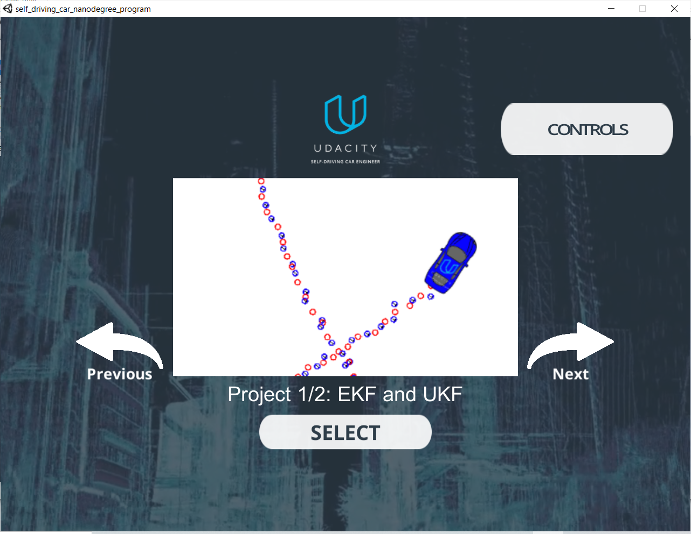
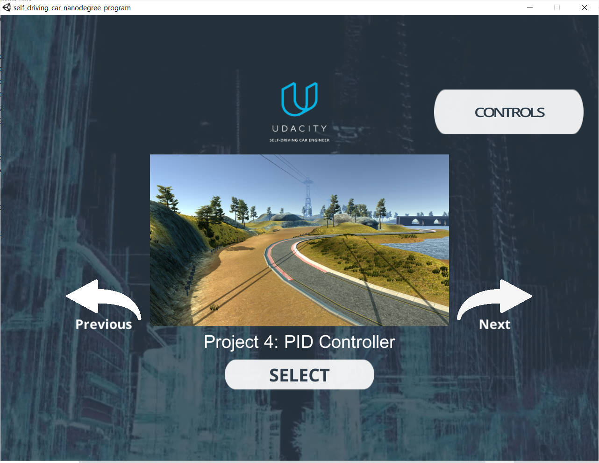
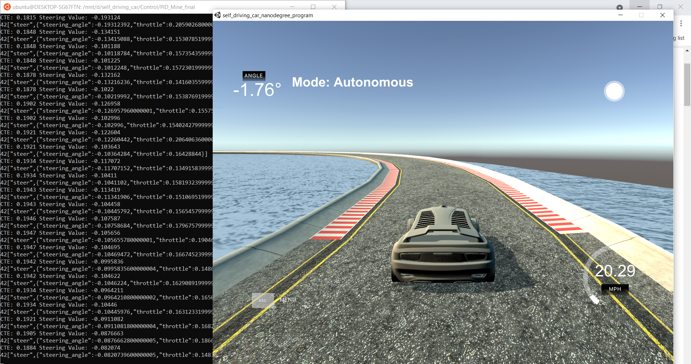

# CarND-Controls-PID
Self-Driving Car Engineer Nanodegree Program 

The aim of this project is to implement a PID controller on a self driving car in Udacity's simulator. There are two PID controllers used here, one for controlling the steering by taking the cross track error (CTE) as an input. The other PID controller controls the speed at a given value using the throttle command. Both inputs to the simulator are limited to certain values, the steering controller are limited at [-1, 1]. The interface between the simulator and the PID controlller code is done through uWebSoockets. 
---

## Dependencies

* cmake >= 3.5
 * All OSes: [click here for installation instructions](https://cmake.org/install/)
* make >= 4.1(mac, linux), 3.81(Windows)
  * Linux: make is installed by default on most Linux distros
  * Mac: [install Xcode command line tools to get make](https://developer.apple.com/xcode/features/)
  * Windows: [Click here for installation instructions](http://gnuwin32.sourceforge.net/packages/make.htm)
* gcc/g++ >= 5.4
  * Linux: gcc / g++ is installed by default on most Linux distros
  * Mac: same deal as make - [install Xcode command line tools]((https://developer.apple.com/xcode/features/)
  * Windows: recommend using [MinGW](http://www.mingw.org/)
* [uWebSockets](https://github.com/uWebSockets/uWebSockets)
  * Run either `./install-mac.sh` or `./install-ubuntu.sh`.
  * If you install from source, checkout to commit `e94b6e1`, i.e.
    ```
    git clone https://github.com/uWebSockets/uWebSockets 
    cd uWebSockets
    git checkout e94b6e1
    ```
    Some function signatures have changed in v0.14.x. See [this PR](https://github.com/udacity/CarND-MPC-Project/pull/3) for more details.
* Simulator. You can download these from the [project intro page](https://github.com/udacity/self-driving-car-sim/releases) in the classroom.

Fellow students have put together a guide to Windows set-up for the project [here](https://s3-us-west-1.amazonaws.com/udacity-selfdrivingcar/files/Kidnapped_Vehicle_Windows_Setup.pdf) if the environment you have set up for the Sensor Fusion projects does not work for this project. There's also an experimental patch for windows in this [PR](https://github.com/udacity/CarND-PID-Control-Project/pull/3).

## Build Instructions


Build and run command : `.\buildAndrun`. This command will first create a build folder then cmake and make the files into it. Finally it will run the binary file `.\pid`

The controller will be listening to port 4567 for CTE, speed and other paramters from the simulator. The simulator should also expect the steering angle and throttle values from the controller. 

Run the Udacity Simulator



Then Chose prject 4 PID controller


After that the pid controller should take over the simulated vehicle through the tracks!. Note: the required speed is 20 m/s and it can be modified. 




Tips for setting up your environment can be found [here](https://classroom.udacity.com/nanodegrees/nd013/parts/40f38239-66b6-46ec-ae68-03afd8a601c8/modules/0949fca6-b379-42af-a919-ee50aa304e6a/lessons/f758c44c-5e40-4e01-93b5-1a82aa4e044f/concepts/23d376c7-0195-4276-bdf0-e02f1f3c665d)

## Editor Settings

We've purposefully kept editor configuration files out of this repo in order to
keep it as simple and environment agnostic as possible. However, we recommend
using the following settings:

* indent using spaces
* set tab width to 2 spaces (keeps the matrices in source code aligned)


## Code Reflection

The code is buildable using cmake and make. The two pid controllers run safely through the tracks.


## PID gains effect on the control. 

The best combination of these gains acheived a good safe drive through the whole loop of the track. The propotional gain is responsible for driving the error to zero as fast as possible. Too little P gain would result in slow error reduction, while too much would result in overshooting and high oscilations. The derivative gain (D) is responsible for eliminating any overshooting by predicting where the error is projected. The integral gain is used to drive the steady state error to zero. This is done by adding up all the errors in the time frame and sending it as a feedback command. 

The output hyperparameter gains for steering control are (Kp = 0.3 ,Ki= .0002 ,Kd= 10.0). For the throttle controller (Kp= 0.5 ,Ki= .0004 , Kd= 2.0). 

